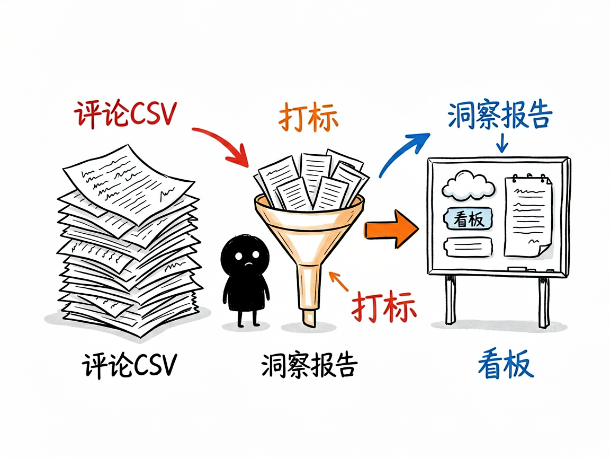
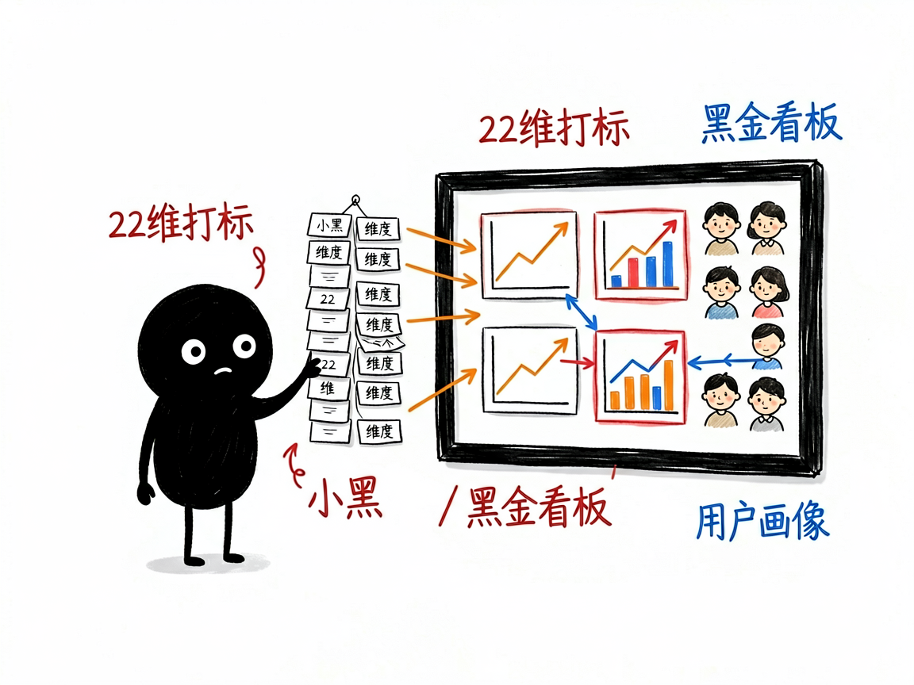

# 一堆电商差评好评看不过来？让它秒变读懂用户的产品参谋 —— simple-review-analyzer 介绍

卖家的后台里堆着成百上千条评论，好评差评混在一起，你明明知道"用户有话说"，却没空一条条看。结果产品该改啥、差评到底卡在哪、哪个卖点最打动人，全凭感觉。尤其是想研究竞品时，对手几百条评论更是无从下手。

**simple-review-analyzer 就是来解决这件事的。**

你给它一份评论的表格文件（CSV），它还你三样东西：打标后的明细数据、一份深度洞察报告、和一个能直接打开看的可视化看板。

---



## 它到底能做什么

- 22 维度智能打标：给每条评论自动贴标签，覆盖人群（性别/年龄/职业）、使用场景、功能满意度、质量（材质/做工/耐用）、服务（发货/包装/客服/退换/保修）、体验（舒适/易用/外观/价格）、竞品对比、复购意愿和情感倾向。
- 识别用户画像：从评论里归纳出 3–4 类典型用户，每类配精选"黄金样本"评论，帮你真正看懂是谁在买。
- 挖 VOC（客户之声）：汇总用户痛点、情感分布和关键词，知道大家到底在意什么。
- 出可视化看板：一个黑金风格 HTML 页面，带 6 个交互图表，浏览器直接打开就能向团队展示。
- 做竞品分析：把对手的评论也喂进去，对比双方优劣势，找差异化机会。

## 一个具体例子

准备一个 CSV（只要有两列：评论内容、评分，列名像"内容/评价/review"或"打分/rating/star"都能自动识别），然后在 AI 助手对话里说：

```
请分析这个产品的评论：reviews.csv
```

它会先问你要分析多少条（100 条 / 300 条 / 全部，推荐 100 条平衡速度与质量），跑完在 `output/产品名_日期/` 下生成 `reviews_labeled.csv`、`分析洞察报告.md`、`可视化洞察报告.html` 三个文件。



## 谁适合用

- 电商卖家：从自家评论里找产品改进点。
- 产品经理：用真实反馈指导功能优先级。
- 品牌方：做竞品评论对比，找差异化定位。
- 市场研究员：批量分析多个产品，看行业趋势和用户偏好。

## 一点说明 / 小提示

这是一个给 AI 助手用的"技能"，不是爬虫——你得自己先把评论导出成 CSV 再交给它，它不负责从平台抓取数据。它靠 AI 模型给每条评论打标，批处理每批最多 30 条，分析数量别贪多，100 条通常最划算。打标是 AI 理解后的归纳，适合找方向和做展示，关键结论建议再回原评论核对。具体能力以项目文档为准。
