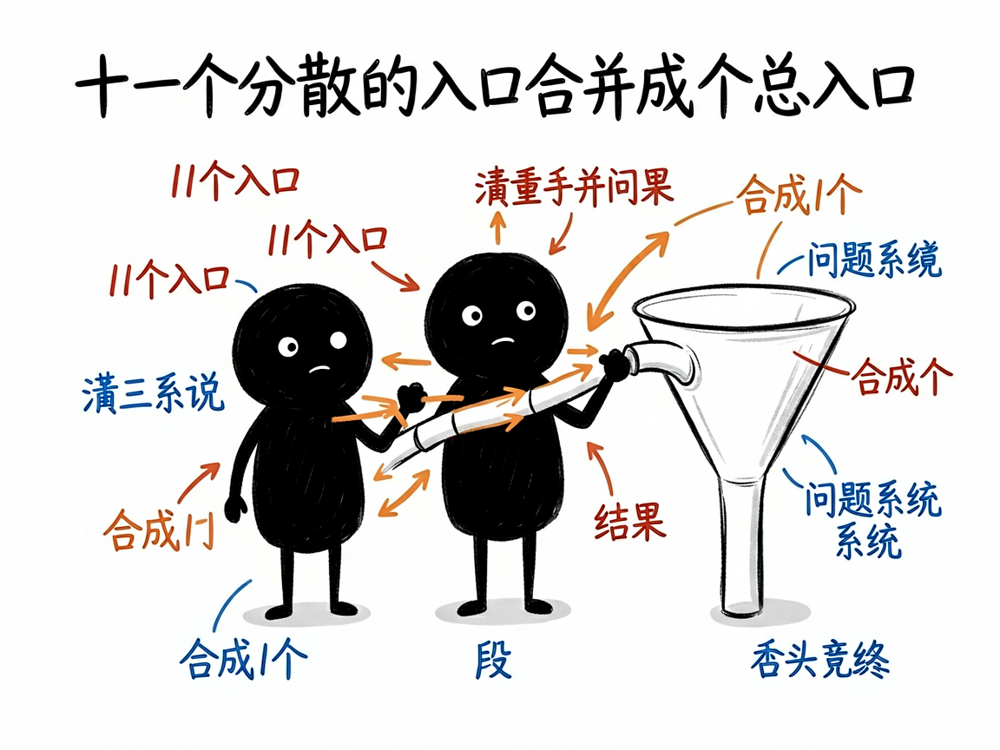
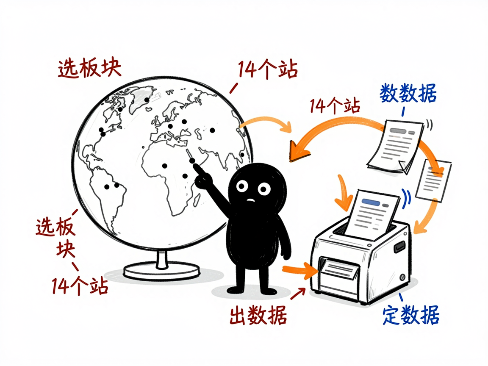

# 想用 Sorftime 挖亚马逊数据，又不想一页页手抄？它一个入口抓 11 类 —— sorftime-rpa 介绍

你用 Sorftime（sorftime.com）做亚马逊卖家分析，它家榜单很多：畅销榜、产品选品、关键词、品牌、卖家，还有各种"反查"工具。手动在网页上点、复制、粘贴，光一个类目就能耗掉一下午。sorftime-rpa 把原来 11 个分散的技能合并成了一个入口，让你一句话抓数据、一句话出报告，覆盖选品和"查竞品/品牌/市场/关键词"两大块。

**sorftime-rpa 就是来解决这件事的。**

你给它一个板块名加站点（比如"美国站、查品牌 Anker"），它还你一份 CSV 数据表，以及一份分析报告。

## 它到底能做什么

选品模块（看榜单、找方向）：

- 畅销榜（bestseller）：每个类目 TOP100 商品。
- 产品选品（product）：各站热销 ASIN。
- 关键词（keyword）：各站热门搜索词及趋势。
- 选品牌（brand）/ 选卖家（seller）：各站品牌榜、卖家榜。
- 选市场（market）：细分市场的规模、新品占比、均价等。

查模块（按条件反查）：

- 查 ASIN（checkproduct）：批量查商品详情，如价格、销量、评价、排名。
- 查品牌（checkbrand）/ 查卖家（checkseller）/ 查市场（checkmarket）：按关键词跨站反查。
- 查关键词（checkkeyword，实验性）：看流量来源、搜索趋势等。

它还支持 14 个亚马逊站点（美国、日本、英国、德国等），并能把 CSV 自动生成中文 Markdown 报告。

## 怎么用

你不需要记任何命令。在 codex / workbuddy 等 agent 装好 sorftime-rpa 技能后，直接对 AI 说话就行：

**场景 1：想看品牌榜**
你：帮我看美国站和日本站的品牌榜。
AI：它会打开 Sorftime、按站点抓下品牌榜数据，整理成表格给你。

**场景 2：想查某个品牌在各站的情况**
你：帮我查一下 Anker 在美国站各个类目里表现怎么样。
AI：它会按品牌跨站反查，把 Anker 在各站的数据整理出来，让你一眼看清它的布局。

**场景 3：想批量查几个商品**
你：帮我查这几个 ASIN 的价格、销量和评价排名。
AI：它会批量查商品详情，把每个编号的价格、销量、评价、排名整理成表，还能生成一份中文分析报告。

## 谁适合用

- 用 Sorftime 做亚马逊选品、竞品监控的卖家和运营。
- 需要跨 14 个站点批量拉品牌、卖家、市场数据的研究人员。
- 想把这些手工活变成可复用流程、定期跑的人。

## 一点说明

它不是双击即用的软件，而是给 AI 助手（如 codex / workbuddy）用的"技能包"。它靠浏览器自动化工具（RPA，让 AI 自动操作网页的工具）驱动你已登录 Sorftime 的真实浏览器去读数据（Sorftime 接口全程加密，所以只能"看"页面解密后的内容，不用配密钥）。因此你先在 agent 里装好对应的浏览器自动化技能、登录 Sorftime 就行。免费会员部分数据会被遮蔽，属于平台限制。查关键词模块标注为实验性，可能不稳定。具体板块和字段以项目 SKILL.md / references 为准。

## 闲鱼接单文案

> 以下服务展示在闲鱼 / 淘宝服务市场发布，用于承接本 skill 的定制开发订单。

**标题：Sorftime亚马逊数据采集 skill软件开发**

**描述：**

专注 AI Agent 技能（skill）定制开发，已做出 Sorftime 全板块自动化采集技能，现成作品可先看演示再下单。一个入口覆盖畅销榜、产品、关键词、品牌、卖家、市场等选品板块和 ASIN / 品牌 / 卖家 / 市场 / 关键词各类反查，支持 14 个亚马逊站点，自动生成中文分析报告。支持按你的站点和板块做个性化定制，交付后装进 codex / workbuddy 等 AI 助手即可使用，全部源码交付、支持二次开发。

**服务内容：**

- 1、需求沟通梳理：先聊清楚你要抓的板块（榜单类 / 反查类）和目标站点，确认电脑已登录 Sorftime，列明功能清单后再动手
- 2、skill交付内容和格式：类目畅销榜 TOP100、热销 ASIN、热门关键词、品牌 / 卖家榜单、市场概况及各类反查数据采集成果（CSV 表格 + 中文 Markdown 分析报告）
- 3、项目功能/系统开发：按你的调研流程定制板块组合、跨站批量抓取与报告模板等功能的开发与联调
- 4、skill源码交付：SKILL.md 技能说明 + 提示词 / 脚本 / 模板 / 报告样例组成的完整技能工程，兼容 codex / workbuddy 等 agent。全部源码 + 安装部署说明 + 使用演示，交付后可自行修改维护
