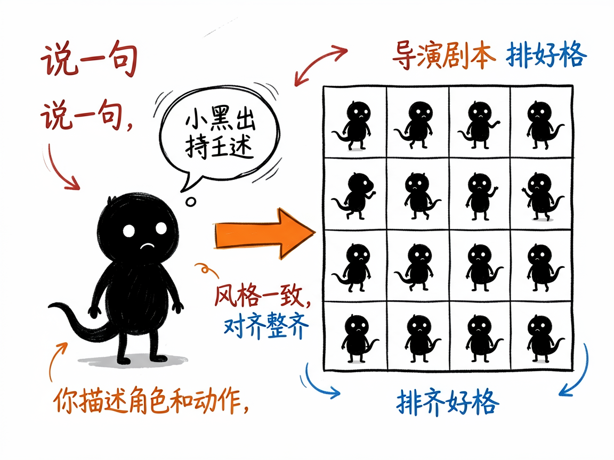
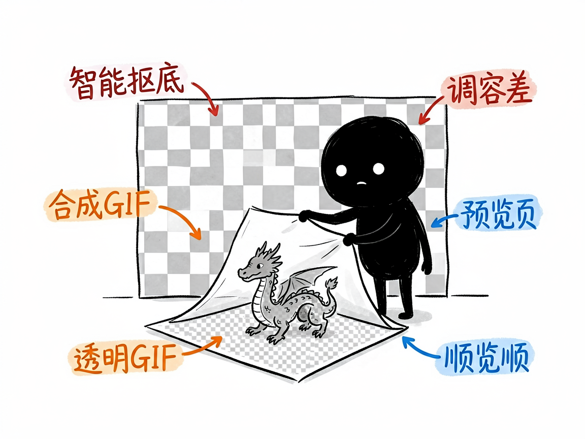

# 想给游戏做个会动的小角色？说一句话它帮你生成精灵图动画 —— sprite-gen 介绍

你在做小游戏、做动效，需要一个会走路、会攻击的小角色动画。过去这得找美术一张张画帧、再拼成"精灵图"（sprite sheet，就是把一连串动作帧排在一张图里）。你既不会画，也不想折腾一堆第三方付费工具。

**sprite-gen 就是来解决这件事的。**

它让你用一段文字描述角色和动作（比如"一只萌萌的小龙，走路循环"），自动生成一张排好格子的精灵图，并切成一帧帧、合成成会动的 GIF，还附一个能在浏览器里预览的页面。你给它一句描述，它还你一套能直接塞进游戏里的动画素材。

---



## 它到底能做什么
- 文字生成角色：你描述长相、风格、动作类型（走 / 攻击 / 待机 / 施法 / 跳舞），它先"导演"出一版具体剧本再出图。
- 生成整齐的格子图：一张方图里排好 N×N 个动作帧（默认 4×4=16 帧），每格角色一致、对齐整齐，方便游戏引擎切片。
- 智能去背景：生成的图往往带杂色背景或水印，它会自动识别并抠掉，保留透明底，方便叠到游戏场景里。
- 切成帧 + 合成 GIF：用图像处理库把大图切成单帧，再编码成带透明度的动画 GIF。
- 出预览页：生成一个 HTML 页面，棋盘格背景上看 GIF 和每一帧，方便你检查动作顺不顺。



## 一个具体例子

```bash
# 先把生成的图切成帧、去背景、合成 GIF
node scripts/process-sprite.mjs \
  --input sprite.png \
  --grid 4 \
  --frame-size 200 \
  --remove-bg \
  --bg-tolerance 60 \
  --outdir ./out
```

`--grid 4` 是 4×4 共 16 帧；`--frame-size 200` 是每帧输出 200 像素；`--bg-tolerance 60` 控制抠背景的宽松度（背景没抠干净就调大，角色边缘被吃就调小）。

## 谁适合用
- 做独立游戏、小游戏，需要角色动画素材的开发者。
- 想快速试验"某个角色动起来啥样"的原型玩家。
- 做 AI 工具、要把"文字生成游戏动画"做成能力的人。

## 一点说明 / 小提示
它是一个"AI 技能"，核心靠 AI 生图能力出图，再靠 Node.js 脚本切图合成；运行需要本地装好 `sharp`、`gifenc` 这两个图像处理库和 Node.js 18+。由于 AI 生图目前不能保证透明背景，它内置了"自动抠背景"来补救，但复杂背景偶尔会有瑕疵，需要调 `--bg-tolerance` 或换生成策略。它产出的是素材，最终游戏手感还得你来调。具体能力以项目文档为准。
