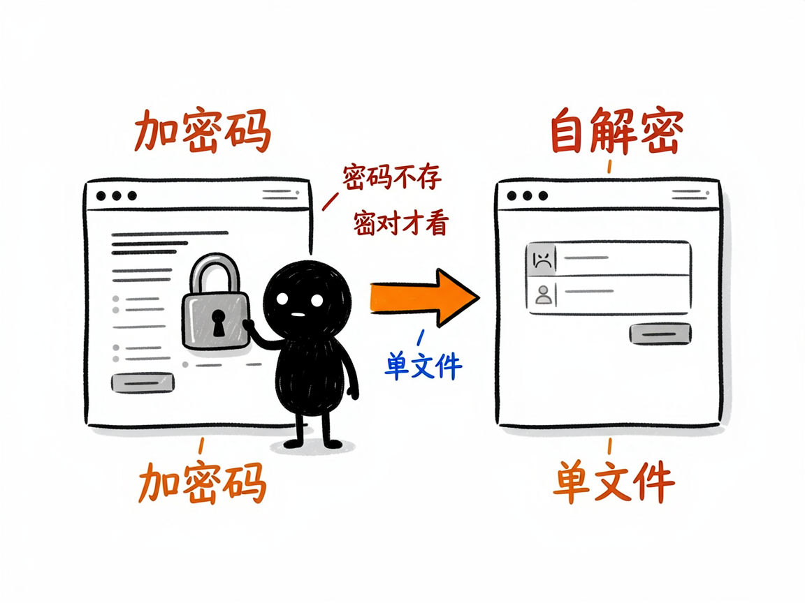
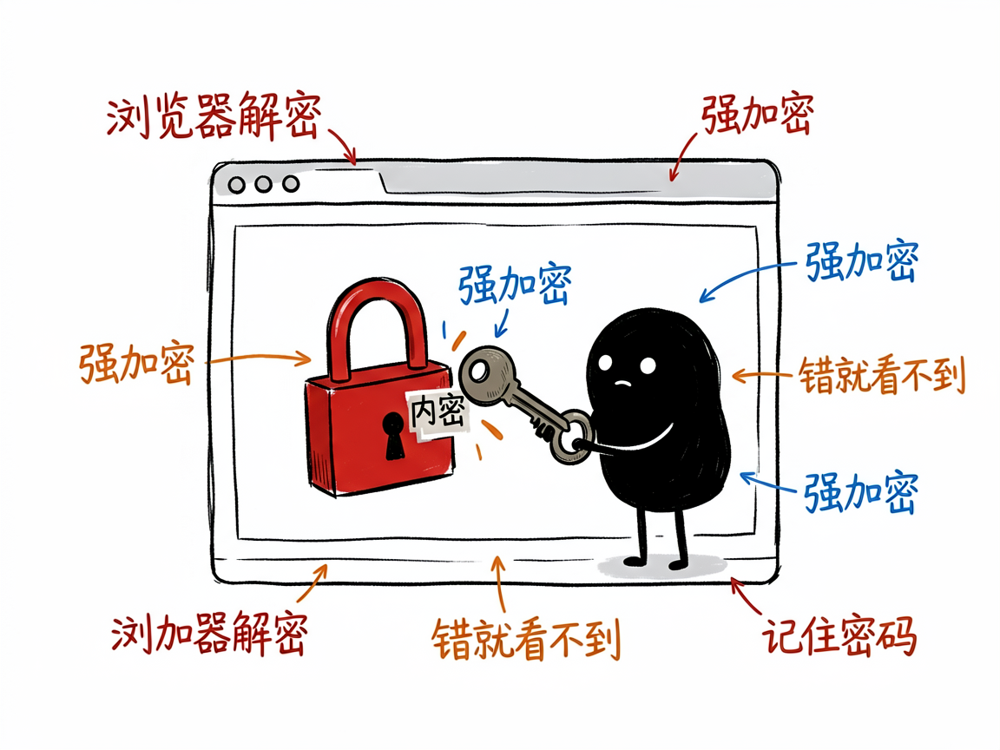

# 想给网页加个密码锁、只有知道密码的人能看？它把 HTML 加密成自解密页面 —— staticshield 介绍

你做了个网页——也许是份内部资料、一封电子请柬、一个只在小圈子里传的页面——你不想谁都能随便打开，但又没有服务器、不会搭登录系统。普通的"网页加密"要么要后端，要么形同虚设。

**staticshield 就是来解决这件事的。**

它把一个 HTML 网页加密成一个"自带解锁页"的文件：别人打开它，看到一个输入密码的框，输对密码才能在浏览器里当场解密、看到原内容；密码错就啥也看不到。你给它一个网页和密码，它还你一个能直接放到任意托管（比如网盘、CDN，甚至本地双击打开）上、靠密码保护的安全页面。

---

## 它到底能做什么
- 单文件加密：把一篇网页加密码变成自包含的解锁页，不依赖任何后端服务器。
- 整站打包加密：一整个文件夹（网页 + 样式 / 脚本 / 图片）可以"内联"成单文件再加密，或批量加密成一包。
- 强加密：用业界标准的强加密算法（AES-256）配合密钥派生，密码够强就够安全。
- 自动生成强密码：自己想不出密码时，它可以帮你随机生成一串够长的密码。
- 贴心小功能：可加"记住我"、密码提示、自定义解锁页图标，甚至生成一个把密码藏在链接里的分享地址。

## 怎么用
你不需要记任何命令。在 codex / workbuddy 等 agent 装好 staticshield 技能后，直接对 AI 说话就行：
**场景 1：把一份内部资料加密码**
你：帮我把这份内部汇报网页加密，密码设成"XX2026"，生成一个能直接发群里的安全页面。
AI：它把网页加密成带密码框的解锁页，你双击或发到网盘上，别人输对密码才能在浏览器里看到内容。
**场景 2：整个小站点打包加密**
你：我这个活动页面是个文件夹，里面有图有样式，帮我整站打包加密，密码我自己设。
AI：它把整个文件夹内联合并成一个加密文件，你拿到后能直接托管，只有知道密码的人能打开。
**场景 3：怕密码不够强**
你：我懒得想密码，你帮我随机生成一个够长的强密码，顺便把解锁页加上"记住我"。
AI：它生成一串高强度随机密码并记在交付说明里，同时给你加上"记住我"等贴心选项。

## 谁适合用
- 想分享敏感/私密网页内容、但不想搭服务器的人。
- 做内部资料、活动页面，需要简单密码保护的小团队。
- 做 AI 工具、要把"网页加密"做成能力的人。

## 一点说明
它是一套 AI 技能，最顺手的是在带它的 AI 助手里说"帮我把这个网页加密"，它来帮你完成加密并告诉你密码。解密发生在浏览器里，所以打开时需要联网环境或直接本地打开都行。务必记住：密码一旦生成就无法找回，它也不会替你存——丢了就只能重新加密。它保护的是"内容不被随便看到"，不等于能防住决心破解的人，密码强度很关键。具体能力以项目文档为准。

## 闲鱼接单文案

> 以下服务展示在闲鱼 / 淘宝服务市场发布，用于承接本 skill 的定制开发订单。

**标题：网页密码加密保护 skill软件开发**

**描述：**

专注 AI Agent 技能（skill）定制开发，已做出网页加密技能，现成作品可先看演示再下单。把 HTML 网页加密成自带密码解锁页的自包含文件：不用服务器，放到网盘、CDN 或本地双击都能用；单文件和整站文件夹打包都支持，AES-256 强加密，还能自动生成强密码、加"记住我"和密码提示、自定义解锁页图标、生成把密码藏在链接里的分享地址。可按你的场景定制，全部源码交付、支持二次开发。

**服务内容：**

- 1、需求沟通梳理：先聊清楚要保护的网页（单页还是整站文件夹）、密码要求和分发方式（网盘 / 链接 / 本地），列明功能清单后再动手
- 2、skill交付内容和格式：加密后的自解锁页面文件（单文件或整站加密包）+ 强密码与使用说明（可含"记住我"、密码提示、藏密码分享链接）
- 3、项目功能/系统开发：按你的场景定制解锁页样式与附加功能，可扩展批量加密等功能的开发与联调
- 4、skill源码交付：SKILL.md 技能说明 + 提示词 / 脚本 / 模板 / 样例组成的完整技能工程，兼容 codex / workbuddy 等 agent。全部源码 + 安装部署说明 + 使用演示，交付后可自行修改维护
