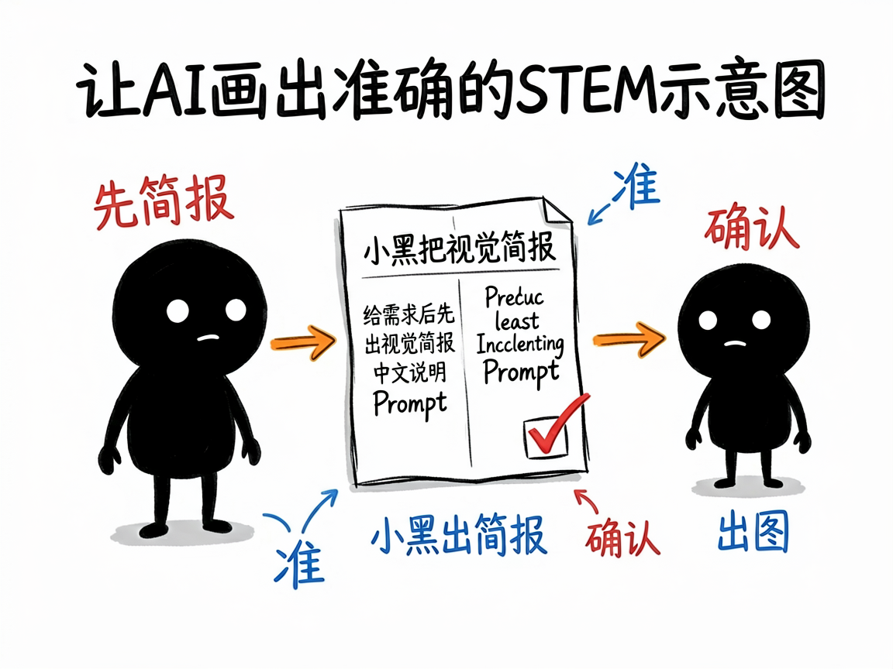
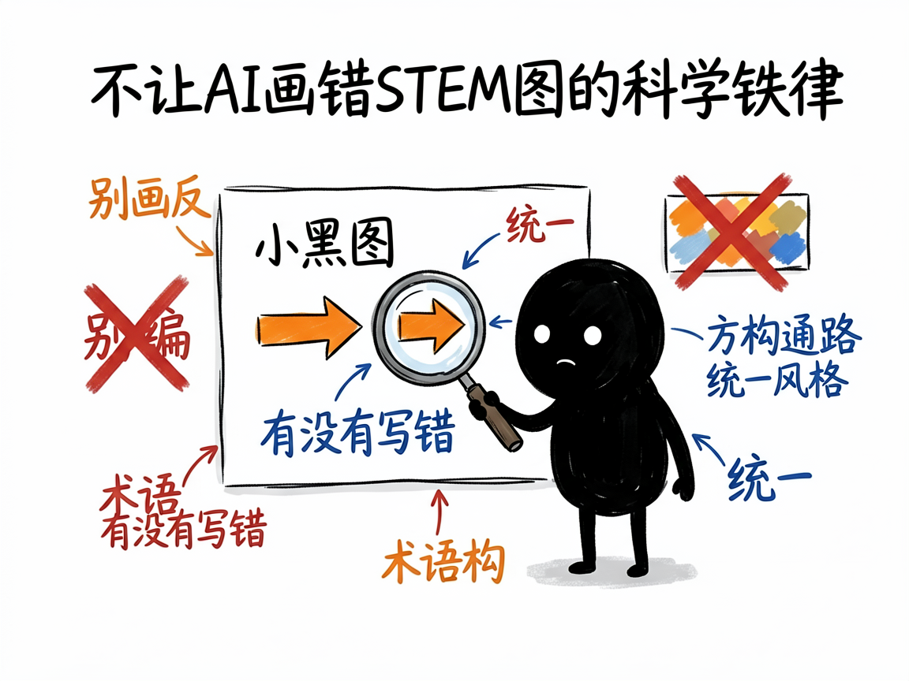

# 一张科研/教学示意图，怎么让 AI 帮你画出来 —— stem-illustration 介绍

写论文、做课件、出科普的时候，经常需要一张示意图：信号通路、实验流程、细胞结构、机制图、学术海报……可这类图要么得请专业画师、要么自己用软件抠半天。更麻烦的是，AI 生图虽然方便，却常把箭头方向画反、把蛋白质名字写错，还不小心编出不存在的通路。

**stem-illustration 就是来解决这件事的。**

你给它一个 STEM（科学、技术、工程、数学）领域的画图需求，它还你一份"视觉简报"——包含准确的中文说明和可直接拿去生图的英文提示词（Prompt）；确认后它能调用接口真把图生成出来。它内置 24 种场景模板、6 大学科适配，还带着一套"科学准确性铁律"，尽量不让 AI 画出错的图。

---



## 它到底能做什么
- 覆盖 6 大学科（生命科学、医学、化学、物理、工程、数学）的概念示意图、教学插图、技术架构图。
- 提供 24 个场景模板：信号通路、实验流程、细胞结构、概念信息图、学术海报、机制图、质粒图、机器学习架构、物理原理图、数学概念图等。
- 有 4 种风格变体可选：学术期刊风、教材插图风、信息图风、3D 渲染风。
- 生图前先产出"视觉简报"：学科、模板、尺寸、配色、核心元素、完整英文 Prompt，你确认后再出图。
- 强制"STEM 提示铁律"：颜色用十六进制码、方向显式声明、术语标准化、禁止虚构数据和相互作用，尽量保准确。
- 多图任务（如一整套论文 Figure）会锁定统一风格（色板、字体、线宽），避免一套图里各画各的。

## 一个具体例子

你跟会用这个项目的 AI 说：

```text
帮我做一张 MAPK-ERK 信号通路图，期刊风格，垂直方向。
```

AI 会匹配 `signaling-pathway` 模板、选 `academic` 变体，给你一份视觉简报和英文 Prompt；你确认后它执行：

```bash
python scripts/generate_image.py --prompt-file ./prompt.txt --size 3:4 --resolution 2k
```

就能得到一张 3:4、2K 分辨率的信号通路图。



## 谁适合用
- 研究生、科研者做论文配图、图文摘要、学术海报。
- 老师做教学插图、课件图。
- 科普作者做生命科学/化学/物理等概念图。
- 需要成套风格统一图示的团队。

## 一点说明 / 小提示

这个项目是给"做 AI 工具 / 出图的人"用的技能（skill），不是普通人直接打开的 App；你给它需求，它产出简报并（在你确认后）调接口生图。它需要你配置好生图接口的密钥（.env 里的地址、模型、API key），否则生不了图。它有明确的"能力边界"：AI 生图适合概念示意、流程、结构类图，但**不保证几何/数学严格正确**，也**禁止**用来生成真实实验数据图（柱状/折线/散点等要用 matplotlib 等代码工具）。严格几何证明图、坐标函数图，项目建议改用代码生成。具体模板与生成效果以项目文档和实际接口为准。
