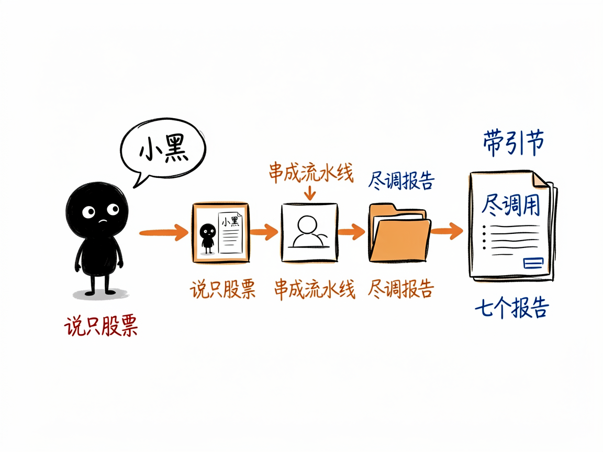
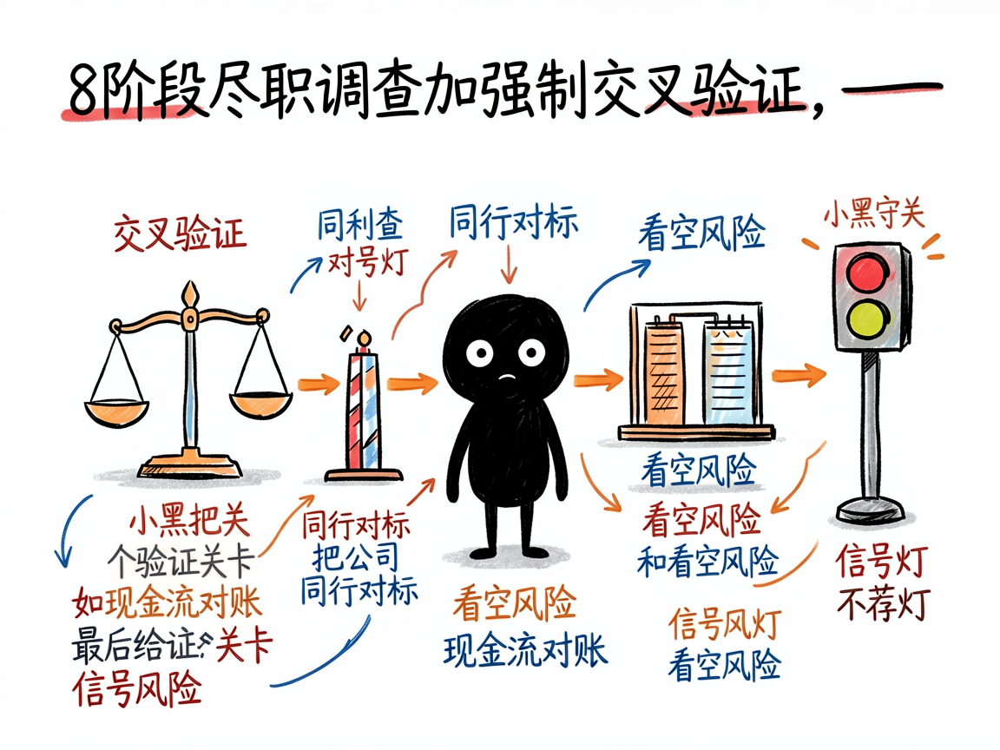

# 说一句"帮我研究下茅台"，它像投研团队一样给你出尽调报告 —— stock-deep-research 介绍

想认真研究一只股票，自己翻财报、搜公告、看研报，半天下来信息散落各处，还分不清哪些是干货、哪些是营销话术。真想搞明白"这家公司生意好不好、财务实不实、价格贵不贵"，门槛其实不低。

**stock-deep-research 就是来解决这件事的。**

你给它一只股票（或公司名、代码），它还你一份像专业投研团队做出来的、带完整引用的尽调报告。它先把 7 个独立的研究技能（问需求、定计划、分头调研、综合、查引用等）串成一条完整流水线，自动跑完。



---

## 它到底能做什么

- 先问清你的需求：投资风格（价值 / 成长 / 红利等）、持有周期、最关心什么（护城河、财务、估值……）、风险偏好，然后生成一份研究计划让你确认。
- 派出多个 AI"研究员"并行干活，对一只股票跑 8 个阶段的尽职调查：公司事实底座、行业周期、业务拆解、财务质量、股权治理、市场分歧、估值与护城河，再加综合报告。
- 强制交叉验证：比如拿经营现金流和净利润对账、把公司和同行全面对标、还必须列出 3 到 5 个看空风险场景，防止只报喜不报忧。
- 每个事实性声明都标出来源，并按 A 到 E 评级（A 是年报和监管文件，E 是论坛传闻），还会做"幻觉检测"，揪出编造的数据。
- 报告末尾给一个信号灯评级（三绿=积极关注、三黄=中性观望、两红=回避），但明确不预测股价、不荐股。
- 也能研究非股票主题（比如固态电池行业），走通用研究流程，同样产出带引用报告；还能单独用来检查你已有报告的引用靠不靠谱。

## 一个具体例子

装好技能后，直接对 AI 说话即可，不需要记命令：

```
帮我研究一下贵州茅台 600519 值不值得投资
```

想跳过提问、直接要结果，把信息给全就行：

```
按价值投资、长期持有、保守风格，帮我尽调腾讯控股 00700.HK
```

最后会在 `RESEARCH/STOCK_600519_贵州茅台/` 这类目录里生成完整报告。



## 谁适合用

- 想认真了解某家公司、但没时间自己翻财报的普通投资者。
- 做基本面研究、需要系统化尽调框架的分析者。
- 需要带引用、可复核的研究文档的产品、战略或投研团队。

## 一点说明 / 小提示

它是给"会用 AI 编程助手（如 Claude Code、ZCode 这类工具）的人"装的技能集合，不是普通人直接打开的 App——得先有能加载技能的环境。它只做研究、不做投资建议：不预测股价、不给买卖点、不承诺收益，只是把基本面研究做扎实，决定要你自己下。投资有风险，报告末尾都会附免责声明。具体能力以项目文档为准。
