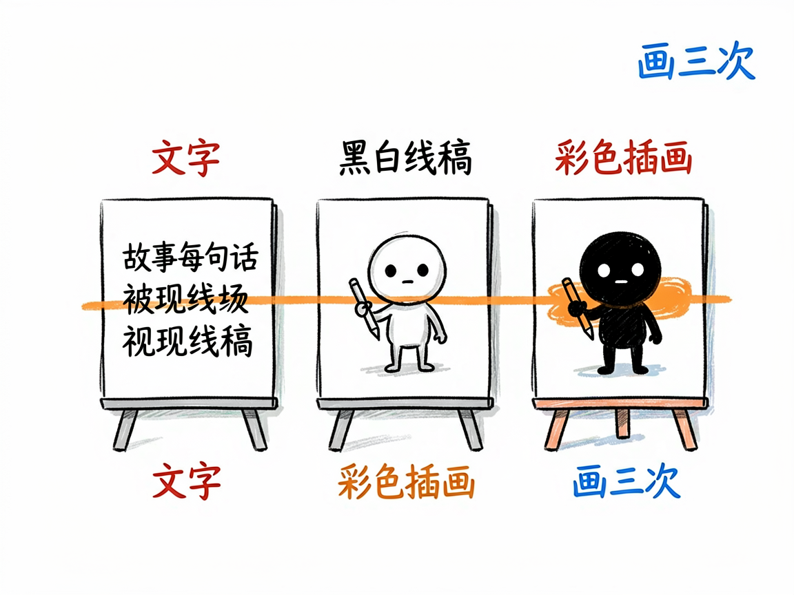
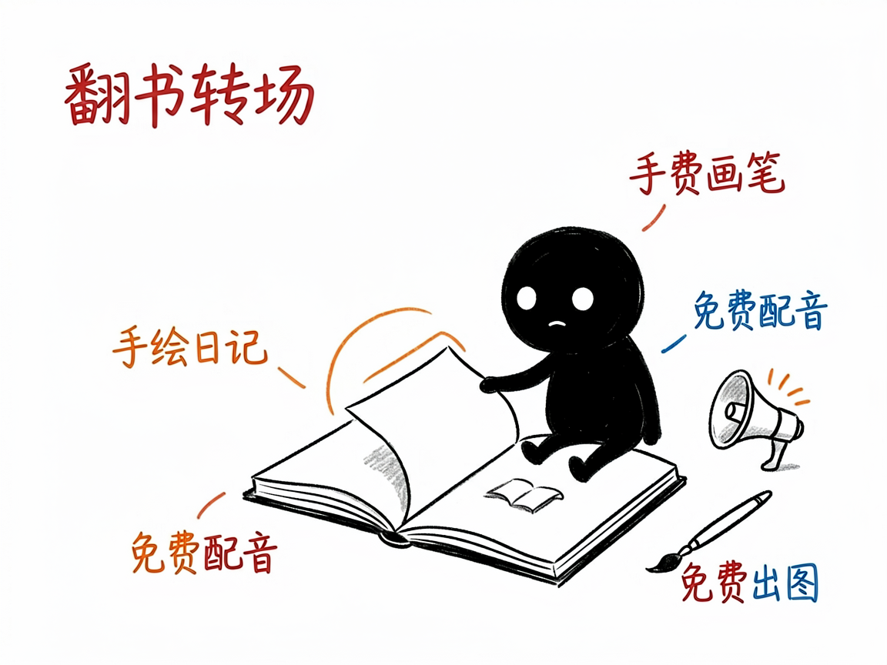

# 有段故事想变成手绘风视频？它让每句话被"画"三次 —— story-handdrawn-remotion 介绍

你想把一段日记、一个童话、或者一个温情小故事做成视频，但嫌真人出镜麻烦，又想要那种手绘日记、蜡笔涂色的治愈感。自己画？一集都画不完。

**story-handdrawn-remotion 就是来解决这件事的。**

你给它一段故事文字，它还你一段 3:4 竖屏的手绘日记漫画动画，每句话都像被现场画出来三次。

---



## 它到底能做什么
- 把故事按句号拆成"一句一拍"，每句配一张图，节奏清晰不堆砌。
- 每句做"文字 → 黑白线稿 → 彩色插画"三次横向擦除揭示，像有人在你面前一笔笔画出来，很有韵味。
- 可选右下角翻书转场，像翻一本手绘日记。
- 默认免费生成图片（agnes 接口）和免费配音（微软 edge 中文女声），也能升级到更高质量的付费方案。
- 额外支持英文教学闪卡模式：顶部英文句子、下方插画加关键词音标，适合中小学英语教学。



## 一个具体例子

写一段故事存成 `story.txt`，一句一行，然后：

```bash
python scripts/gen_story_images.py examples/story.txt --title "世上最美味的泡面"
python scripts/gen_tts.py narration.yaml --out-dir public/audio/narration
npm run render:preview
```

预览片（720×960）就是默认成片，确认要高清再跑 `npm run render`。

## 谁适合用
- 写日记、童话、亲情故事的作者，想做成治愈系短视频。
- 老师做教学小品、步骤插画。
- 想做英文故事教学卡的人（用 `--lang en`）。

## 一点说明 / 小提示
它是跑在 AI 助手里的技能，产出一套 Remotion 工程。默认"70% 质量就交付"，不追求每张图完美——目标是几小时出片。它是静帧擦除风格，不是会动的视频片段（那要看 story-handdrawn-video）。具体能力以项目文档为准。
