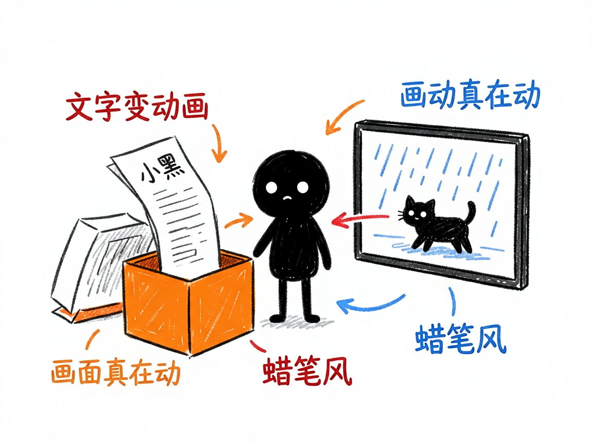
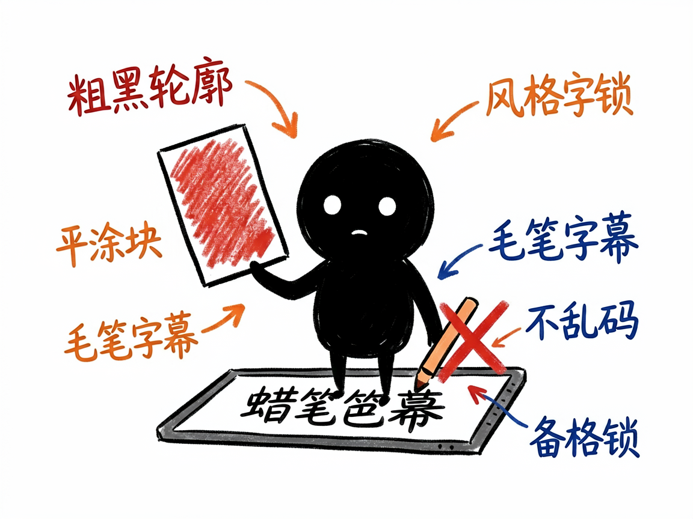

# 想做会动的手绘蜡笔风短视频？它每段直接生成一段动画 —— story-handdrawn-video 介绍

上一个是把静帧一张张擦出来讲，但你想让画面本身就动起来：小猫真的在走、雨真的在下，整段是 Q 版手绘蜡笔风的视频。这种"文生视频"怎么搞？

**story-handdrawn-video 就是来解决这件事的。**

你给它一段故事文字，它还你一条 9:16 竖屏的短视频，每场都是一段会动的蜡笔风动画片段。

---

## 它到底能做什么
- 每一句故事直接生成一段文生视频动画（Agnes Video，一个文生视频模型），画面自己会动，没有擦除、没有翻页。
- 锁定蜡笔手绘风：粗黑轮廓、平涂色块、Q 版比例、定格动画那种轻微顿挫感，风格统一。
- 字幕由视频框架用毛笔字体确定性渲染，绝不让视频模型画中文字（避免乱码）。
- 先配音、再按旁白时长生成视频，音画对齐不裁不补。
- 支持英语教学卡模式：画面是叙事场景，叠加关键词、音标、释义、例句的教学卡，适合课文/词汇教学。

## 怎么用

你不需要记任何命令。在 codex / workbuddy 等 agent 装好 story-handdrawn-video 技能后，直接对 AI 说话就行：

**场景 1：做会动的小猫日记**
你：帮我把"我家小猫今天追蝴蝶"这段故事做成会动的蜡笔风短视频。
AI：它会先给故事配上旁白，再按每句旁白时长生成一段会动的蜡笔风动画——小猫真在跑、蝴蝶真在飞，最后用毛笔字体叠上字幕，给你一条 9:16 竖屏短片。

**场景 2：做童话动画**
你：我想做一个 Q 版手绘风的童话小动画，画面要一直动。
AI：它会锁定蜡笔手绘风（粗黑轮廓、平涂色块、Q 版比例），把每场都做成会动的片段，风格从头到尾统一。

**场景 3：做英文教学卡**
你：帮我做一段英语课文教学视频，要带关键词、音标和例句。
AI：它会切到英语教学卡模式，在叙事画面里叠加关键词、音标、释义、例句的教学卡，适合课文和词汇教学。

## 谁适合用
- 做童话、生活日记、情感小品的博主，想要会动的蜡笔风。
- 英语课文、词汇、听力教学视频的制作者。
- 想要"画面真在动"而非静帧擦除效果的人。

## 一点说明
它是跑在 AI 助手里的技能，产出一段会动的视频。免费额度下视频生成较慢（每段几十秒到两分钟、限流每分钟一次），要有耐心。跨场人物脸可能不一样（纯文生视频锁不住脸），这是正常的。它依赖 Remotion（一个用代码做视频的开源框架，但你不用写，AI 帮你写）来生成画面。具体能力以项目文档为准。
