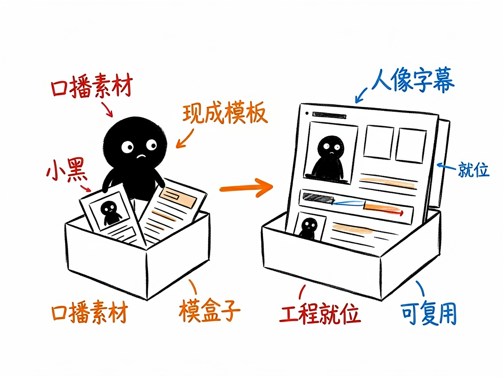
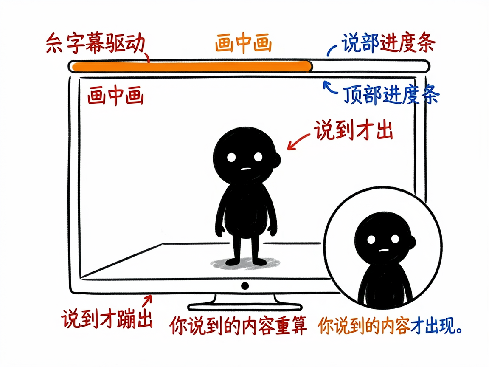

# 要做口播视频，又不想从零搭工程？它给你一套现成的模板 —— talking-head-remotion 介绍

你想做口播视频：自己出镜讲干货，配字幕、加个录屏、底部来条进度条。可是一打开视频工程就懵了——背景怎么做、字幕怎么对齐、人像放哪、动效从哪来？

**talking-head-remotion 就是来解决这件事的。**

你给它口播音频（或视频）和脚本，它还你一套能直接运行、可复用的口播视频工程，人像、字幕、进度条、动效都帮你排好。

---



## 它到底能做什么
- 一键脚手架生成可运行项目，并自带跨项目公共素材库：字体、音效、背景音乐、可复用动效组件。
- 右下角圆形画中画放你的口播人像（看到头和肩膀），底部同步字幕，顶部章节进度条。
- 字幕驱动时间线：你说到的内容才蹦出来，不整页 PPT 式铺满，画面有呼吸感。
- 支持挂录屏、截图、音效和背景音乐，BGM 永远压在人声下面不抢戏。
- 默认横屏 1920×1080，现代暖白工作室风格；竖屏需要单独调那几层。



## 一个具体例子

一条命令搭好工程（素材可后补）：

```bash
python3 ./skills/talking-head-remotion/scripts/scaffold_talking_head_remotion_project.py \
  --project-dir "/path/to/new-project" --title "视频标题" --script "脚本.md" \
  --talking-head "koubo.mp4"
```

随后 `npm install && npm run render:preview` 出低清样片确认，满意再出正式版。

## 谁适合用
- 做知识分享、行业解读的口播博主。
- 想把现有 HyperFrames 口播模板迁移到 Remotion 的人。
- 需要稳定、可复用口播工程结构的团队。

## 一点说明 / 小提示
它是跑在 AI 助手里的工程模板/技能，不是录视频的软件——你先得有口播素材。它强调"元素逐个进场、每屏文字别太多"，适合讲干货而不适合强剧情。具体能力以项目文档为准。
