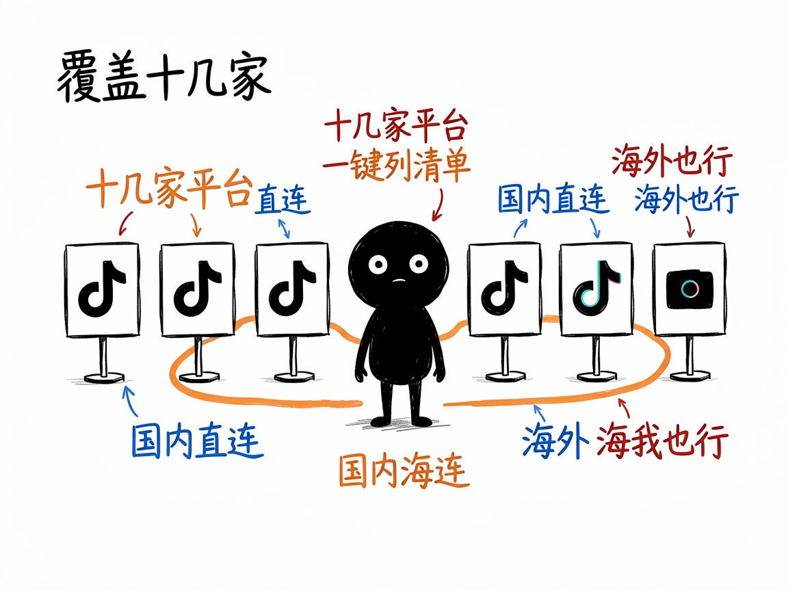

# 想抓抖音、小红书、TikTok 的数据？它帮你查接口、调接口 —— tikhub-api-helper 介绍

你做运营、做研究，或者就是好奇：某个博主有多少粉丝、某条视频下面大家在聊什么、最近某个话题在 TikTok 上火成啥样。你听说这些数据都有官方接口能拿，但面对几十个平台、几百个接口名，根本不知道从哪个下手、参数怎么填。

**tikhub-api-helper 就是来解决这件事的。**

它帮你使用 TikHub 这家数据服务商提供的接口，去取各大社交平台上的公开内容。你给它一句人话（比如"我想查某个 TikTok 用户资料"），它还你该调哪个接口、参数怎么写，甚至直接帮你把数据要回来。你给它一个想法，它还你一份整理好的数据。

## 它到底能做什么

- 按关键词找接口：比如搜"user profile""视频评论""trending"，它会列出匹配的接口和需要填的参数。
- 按平台列清单：覆盖 TikTok、抖音、小红书、Instagram、YouTube、Twitter、Reddit、B站、微博、知乎等十几家，每家有哪些接口一目了然。
- 直接调接口取数：拿到接口名和参数后，帮你发起请求，把返回结果整理好给你看。
- 看接口详情：告诉 AI 你想看哪个接口，它就把这个接口要传哪些必填参数列清楚，避免瞎填。
- 支持国内/海外两种访问地址：在国内会自动走能直连的域名，少折腾。

## 怎么用

你不需要记任何命令。在 codex / workbuddy 等 agent 装好 tikhub-api-helper 技能后，直接对 AI 说话就行：

**场景 1：想知道查某个博主该用哪个接口**
你：我想查某个 TikTok 用户的资料，该调哪个接口？
AI：它会帮你找到匹配的接口，列出名字和要填的参数，甚至直接把数据取回来给你。

**场景 2：想知道接口要填什么参数**
你：这个查用户资料的接口，具体要传哪些参数？
AI：它会把必填参数一项项列清楚，告诉你每个参数怎么填，免得你瞎试。

**场景 3：想直接把数据要回来**
你：别光告诉我接口了，直接帮我把这个博主的数据抓下来。
AI：它发起请求、把返回结果整理好给你看，你拿到就是现成的数据。

## 谁适合用

- 做社媒数据分析、竞品调研的运营或分析师。
- 想批量采集公开内容做研究的开发者。
- 搭 AI 工具、需要接社交媒体数据的人。

## 一点说明 / 小提示

它是个给想查接口、调接口的人用的助手，本质是把海量的 TikHub 接口"翻译"成你能用的步骤，不是给完全不懂技术的人直接点的按钮。取数据需要一个 TikHub 账号的 API 令牌（开发时可用内置默认令牌试，正式用得去 tikhub.io 申请自己的），并且要遵守各家平台的速率限制。它只处理公开的接口数据，具体能取到多少以平台开放范围和你的账号额度为准。具体能力以项目文档为准。
