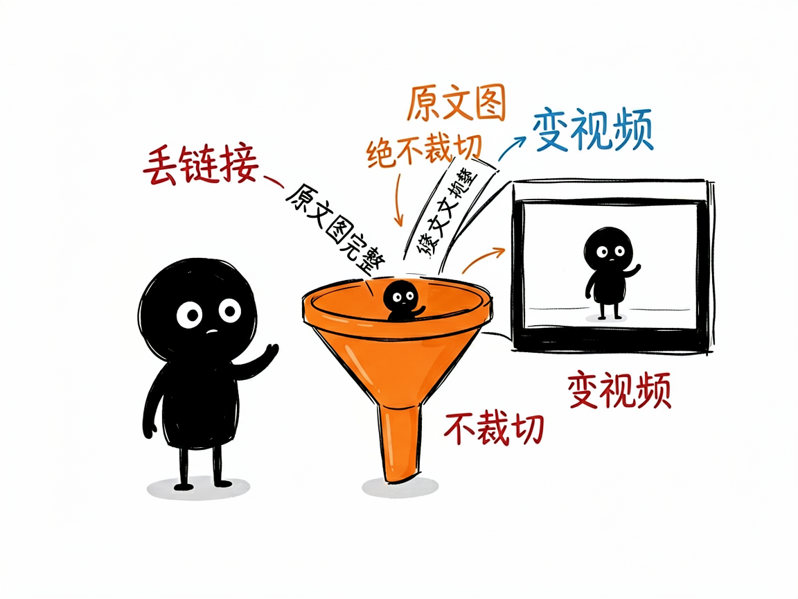
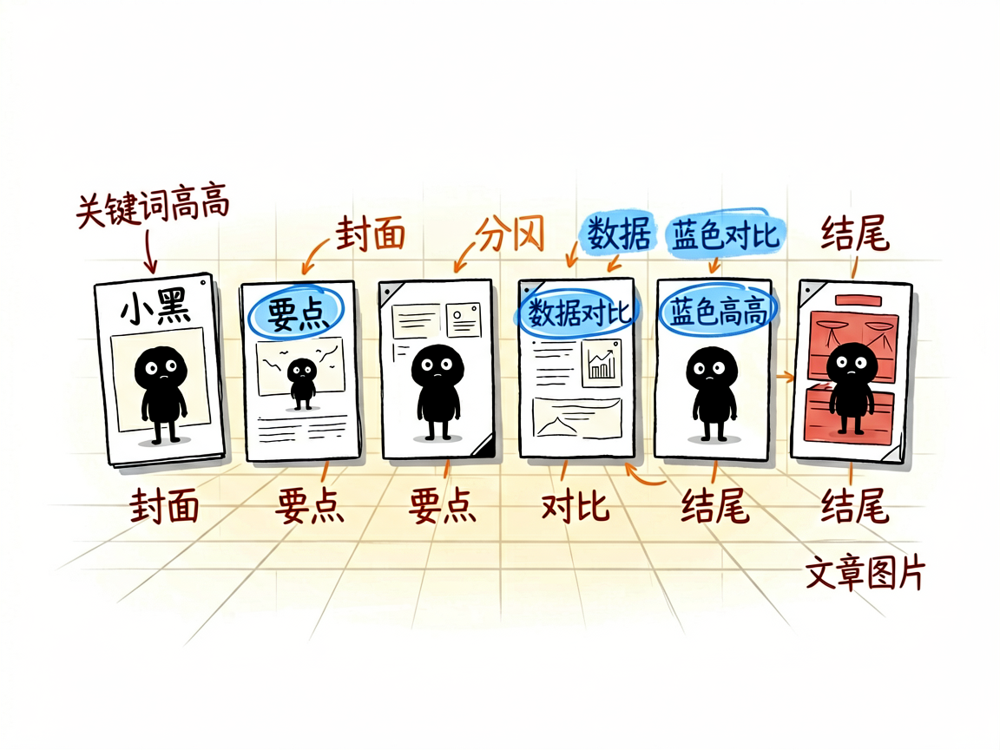

# 有一篇公众号文章想变成视频？丢个链接就行 —— wechat-article-remotion 介绍

你写了一篇（或看了一篇）不错的公众号文章，想把它变成能发的视频，但不想重新写脚本、重新排版、重新找图。最好能把原文图原样用上，别被裁掉。

**wechat-article-remotion 就是来解决这件事的。**

你给它一个公众号文章链接，它还你一段 Studio 风格的视频，原文图完整保留、字幕和章节自动排好。

---



## 它到底能做什么
- 直接读公众号链接（mp.weixin.qq.com），自动抓正文和原文图片下载到工程里。
- 把文章拆成 6~12 个场景：封面、要点清单、数据、对比、结尾，外加专门的"文章图片"场景。
- 原文图永远完整显示、绝不裁切（这是铁律），适合图文并茂的长文。
- 自动生成配音（MiniMax 高质量或免费的微软 edge 配音）和同步字幕，关键词蓝色高亮。
- 暖白画布加透视格子背景，顶部章节进度条，整体干净、像知识类栏目。



## 一个具体例子

给链接，一条命令搭好工程：

```bash
python3 skills/wechat-article-remotion/scripts/scaffold_wechat_article_project.py \
  --project-dir ./demo-wx-article --title "示例公众号文章" \
  --article-url "https://mp.weixin.qq.com/s/xxxxx"
cd demo-wx-article && npm install && npm run still
```

随后由助手拆稿、配音、出 `npm run render:preview` 预览，确认再出 1080p。

## 谁适合用
- 公众号作者，想把手头文章分发成视频触达更多平台。
- 做内容二创、把好文转成短视频的运营。
- 需要保留原文配图、不想重新找素材的人。

## 一点说明 / 小提示
它是跑在 AI 助手里的技能，产出 Remotion 工程，不是直接粘贴链接就出片的网站。关键点：公众号常见"一段文字配一张图"，图属于前面那段文字，配错会图文错位。具体能力以项目文档为准。
