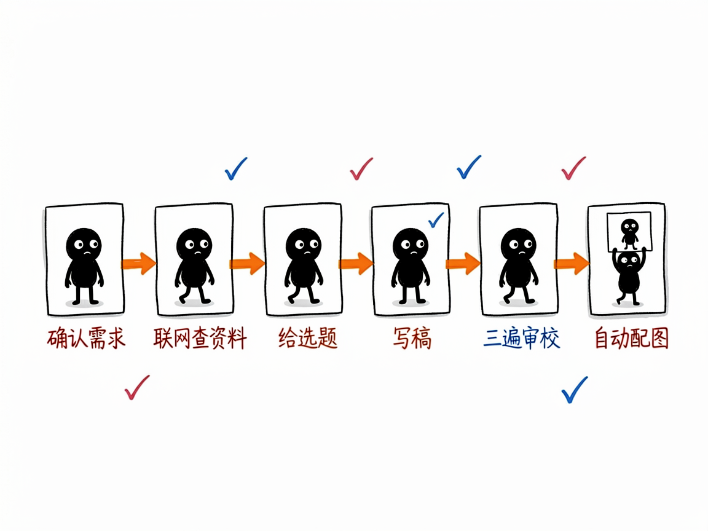
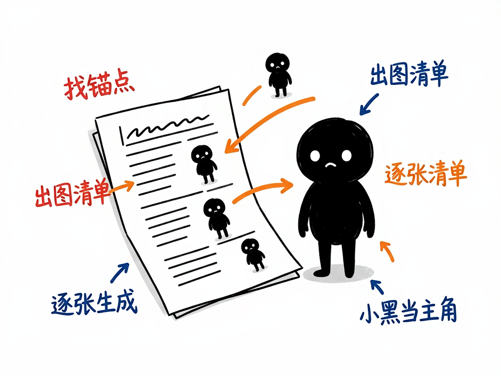

# 想认真运营公众号却卡在"写+配图"？这个助手从选题一路帮你写到出图 —— wechat-writer 介绍

做公众号最累的其实不是写一篇，而是"写之前想选题、写的时候调语气、写完还要满世界找配图"。尤其科技、AI、管理这类内容，既怕写得像机器稿，又怕图片风格不统一、和文章对不上。

**wechat-writer 就是来解决这件事的。** 你给它一个主题（或一段初稿），它还你一篇有大卫风格、经过审校、并且自动配好"小黑怪诞手绘"正文的公众号文章。它把"确认需求→联网查资料→给选题→写稿→三遍审校→自动配图"整条链路打通了，你基本不用在写和配图之间来回切。

## 它到底能做什么

- 覆盖全流程：需求确认、信息搜索、选题讨论、初稿写作、三遍审校、爆款优化，最后自动触发配图。遇到新概念/新产品，它强制"先搜索、再选题、再写、再配图"，不跳步。
- 给 3–4 个选题卡片（含标题、角度、类型、大纲）让你挑，而不是一上来就硬写。
- 支持"一键直出"模式：你说"直接写"，它就只做最小假设直接出完整稿，省去来回问答。
- 也支持只改稿、只审校、只优化标题/开头/结尾，或"只配图"不碰文字。
- 默认带联网检索，涉及时间、数据、产品能力等可核查事实时，会在文末给出参考来源清单，不瞎编。
- **写审校完成后自动配图**：分析文章的"认知锚点"（核心判断、前后对比、流程等），产出配图清单（shot list），逐张生成小黑风格配图并插回文章。

## 怎么用

你不需要记任何命令。在 codex / workbuddy 等 agent 装好 wechat-writer 技能后，直接对 AI 说话就行：

**场景 1：给个主题就让它从头写到出图**
你：帮我写一篇公众号文章，主题"中小公司怎么用 AI 提效"，读者是企业管理者和职场人，2000 字左右，要联网查资料，也要配图。
AI：它先给 3–4 个选题卡片让你挑，选定后出稿、做三遍审校，再自动生成 4–6 张小黑风格配图插回文章，最后存成一篇完整的稿子。

**场景 2：只想快速出稿**
你：直接写，主题"远程办公的三个坑"，1500 字，不用配图。
AI：它走"一键直出"模式，只做最小假设直接出完整稿，省去来回问答，你拿到就能用。

**场景 3：已有文章只补图**
你：我这篇已有文章只想加配图，文字一个字都别动。
AI：它走配图流程，分析认知锚点产出图清单，生成小黑风格配图插回去，完全不碰你的文字。

## 谁适合用

- 公众号作者（尤其科技/AI/管理/职场方向），想稳定产出还带统一配图。
- 企业市场/运营，需要周期性发文又缺设计和写作人力。
- 知识博主，想把观点文章写得更有个人风格、更"不像 AI 写的"。

## 一点说明

它默认是大卫的风格（重真实经历、清晰结构、轻评论、金句收束），且默认开启配图。如果你不想配图，说一句"不要配图"它就会跳过。配图能力是"借"了另一个技能（ian-xiaohei-illustrations）来实现的，要那个技能也在才能跑。它是装在 AI agent 里的一个技能（不是双击打开的 App）；配图依赖外部生图接口，具体可用性以项目说明文档为准。

## 闲鱼接单文案

> 以下服务展示在闲鱼 / 淘宝服务市场发布，用于承接本 skill 的定制开发订单。

**标题：公众号文章写作+配图 skill软件开发**

**描述：**

专注 AI Agent 技能（skill）定制开发，已做出公众号写作全链路技能，现成作品可先看演示再下单。确认需求 → 联网查资料 → 给 3–4 个选题卡片 → 写稿 → 三遍审校 → 自动配图一整条链路打通：先搜再写不瞎编，文末附参考来源；写完自动分析文章认知锚点，逐张生成统一的小黑手绘配图插回正文。支持一键直出、只改稿、只配图等模式。可按你的公众号风格定制，全部源码交付、支持二次开发。

**服务内容：**

- 1、需求沟通梳理：先聊清楚文章主题、目标读者、篇幅、要不要联网查资料和配图，列明功能清单后再动手
- 2、skill交付内容和格式：完整公众号文章稿：选题卡片、正文（大卫风格、三遍审校）、4–6 张统一风格配图、文末参考来源清单
- 3、项目功能/系统开发：按你的公众号调性定制写作风格、审校规则与配图风格，可扩展定时选题等功能的开发与联调
- 4、skill源码交付：SKILL.md 技能说明 + 提示词 / 脚本 / 模板 / 文章样例组成的完整技能工程，兼容 codex / workbuddy 等 agent。全部源码 + 安装部署说明 + 使用演示，交付后可自行修改维护
