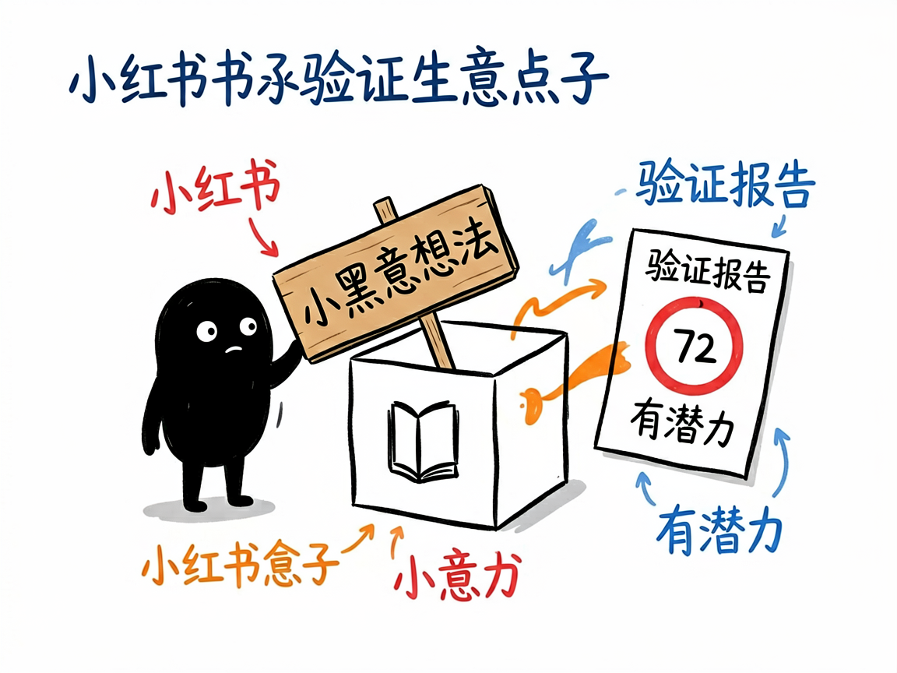
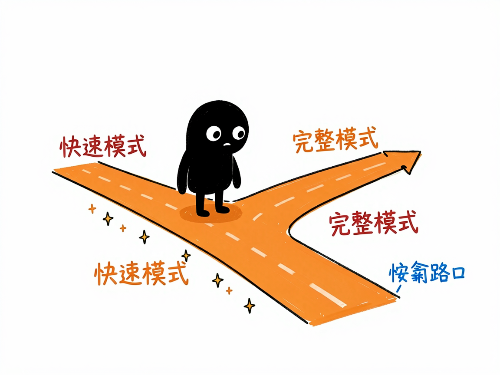

# 有个生意点子？先丢到小红书里看看大家买不买账 —— xhs-business-validator 介绍

你冒出一个点子："在深圳卖陈皮怎么样？""做个针对宝妈的收纳课行不行？"光靠自己拍脑袋，永远在"我觉得行"和"万一没人要"之间反复横跳。其实小红书上早有一堆人在讨论这类话题、吐槽痛点、晒需求——只是你没力气一条条翻完。

**xhs-business-validator 就是来解决这件事的。** 你给它一个生意想法，它还你一份带 0–100 评分的小红书市场验证报告，告诉你这个点子到底有没有戏。

## 它到底能做什么

- 搜笔记和评论：通过 TikHub 接口（一个第三方数据服务）拉取小红书上和你想法相关的笔记和评论。
- 挖用户痛点：从大家的自来水和评论里，提炼出真实抱怨和没被满足的需求。
- 看现有方案：现在用户都在用什么办法解决，市场是不是已经很卷。
- 打分定性：综合 0–100 分（80+ 机会大、60–79 有潜力、40–59 再验证、0–39 风险高），一句话给结论。
- 出 HTML 报告：含统计指标、关键痛点、解决方案、市场机会、建议、热门笔记 Top3、评论标签分析和用户画像。
- 两种模式：快速模式（约 1–2 分钟，看 5 条评论）和完整模式（约 5–15 分钟，看 20 条），按需选。

## 怎么用

你不需要记任何命令。在 codex / workbuddy 等 agent 装好 xhs-business-validator 技能后，直接对 AI 说话就行：

**场景 1：验证一个点子**
你：帮我验证一下在深圳卖陈皮这个想法。
AI：它先问你要快速还是完整模式，跑完先给一句话结论："评分 72/100，有一定市场潜力"，再展开关键发现——大家在抱怨什么、现在用什么方案、你的机会在哪。

**场景 2：给账号定位找方向**
你：我想做个针对宝妈的收纳课，先看看小红书上有没有人需要。
AI：它去抓相关笔记和评论，分析宝妈群体的真实痛点和现有方案，给你一份带评分的验证报告，帮你判断这个方向值不值得做。

**场景 3：快速试水温**
你：我有个小品类想随手看看热度。
AI：它用快速模式一两分钟扫一遍，给你一个大致分数和几条关键评论，帮你低成本试水，不纠结。

## 谁适合用

- 想在国内（尤其小红书受众）做点小生意的人：快速试水温。
- 品牌方和 content 创作者：看某个品类在小红书上的声量和痛点。
- 选品、做账号定位的人：先验证需求再动手，少踩坑。

## 一点说明

这是给 AI 助手用的技能，装好、接好 TikHub 的数据接口就能拉小红书数据（密钥只存在你本地，不外传）。好消息是快速模式用 AI 助手自身能力分析，不强制要额外的 AI 模型密钥。它分析的是公开笔记和评论，评分是 AI 基于讨论热度、反馈和竞争情况综合判断的方向性结论，不能替代真实成交测试。注意它只覆盖小红书这一个平台的数据。

## 闲鱼接单文案

> 以下服务展示在闲鱼 / 淘宝服务市场发布，用于承接本 skill 的定制开发订单。

**标题：小红书生意点子验证 skill软件开发**

**描述：**

专注 AI Agent 技能（skill）定制开发，已做出小红书市场验证技能，现成作品可先看演示再下单。把你的生意想法拿到小红书上抓相关笔记和评论，挖真实痛点、看现有方案卷不卷，给出 0–100 评分（80+ 机会大、60–79 有潜力、40–59 再验证）和 HTML 验证报告；快速模式 1–2 分钟、完整模式 5–15 分钟。支持按你的品类做个性化定制，交付后装进 codex / workbuddy 等 AI 助手即可使用，全部源码交付、支持二次开发。

**服务内容：**

- 1、需求沟通梳理：先聊清楚你的生意想法和模式选择（快速试水 / 完整验证），确认 TikHub 数据接口可用，列明功能清单后再动手
- 2、skill交付内容和格式：0–100 评分与一句话结论、关键痛点、现有解决方案、市场机会、热门笔记 Top3、评论标签分析与用户画像（HTML 验证报告）
- 3、项目功能/系统开发：按你的品类定制分析维度、评分口径与报告模板，可扩展多平台数据源接入等功能的开发与联调
- 4、skill源码交付：SKILL.md 技能说明 + 提示词 / 脚本 / 模板 / 报告样例组成的完整技能工程，兼容 codex / workbuddy 等 agent。全部源码 + 安装部署说明 + 使用演示，交付后可自行修改维护
